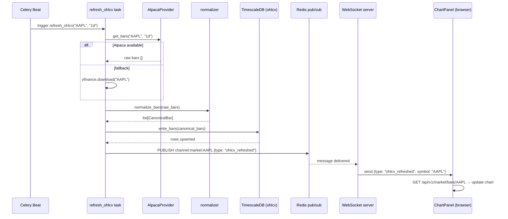
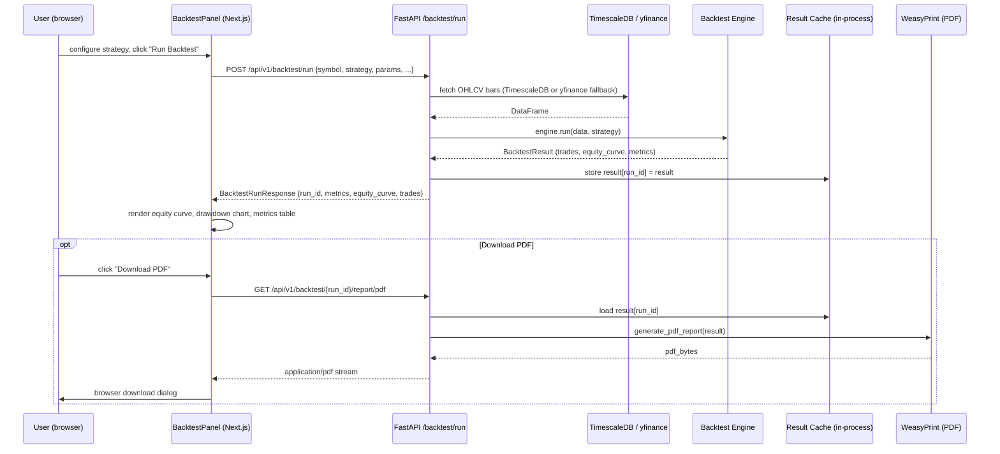
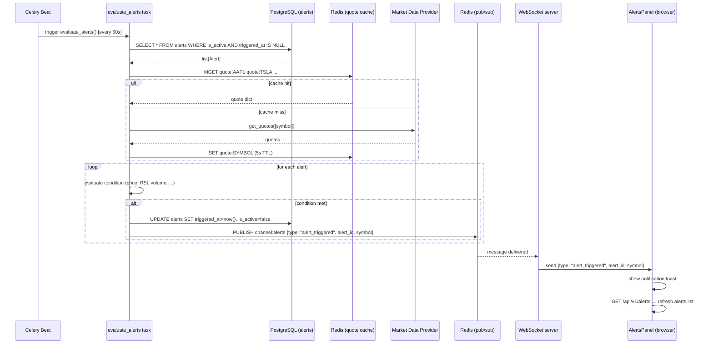

# Data Flow — QuantNexus

Three key data flows are described below: market data ingestion, backtest execution, and alert
evaluation. Each includes a Mermaid sequence diagram and a numbered narrative.

---

## A. Market Data Ingestion

### Narrative

1. **Celery Beat** triggers the `refresh_ohlcv("AAPL", "1d")` periodic task every 5 minutes
   via the crontab schedule defined in `backend/app/tasks/data_tasks.py`.
2. The task calls **`AlpacaProvider.get_bars()`** to fetch recent OHLCV bars from the Alpaca
   market data API. If Alpaca credentials are absent or the request fails, the provider router
   falls back to **yfinance**.
3. Raw bars are passed through **`normalizer.normalize_bars()`**, which converts provider-
   specific field names to the `CanonicalBar` schema (`time`, `open`, `high`, `low`, `close`,
   `volume`, `vwap`).
4. **`writer.write_bars()`** upserts the normalized bars into the **TimescaleDB `ohlcv`
   hypertable** using an `INSERT ... ON CONFLICT DO NOTHING` strategy.
5. After a successful write, the task publishes a `{"type": "ohlcv_refreshed", "symbol": "AAPL",
   "timeframe": "1d"}` message to the Redis pub/sub channel `channel:market:AAPL`.
6. The **WebSocket server** (`market_feed.py`) has an active subscription to that channel and
   relays the message to all WebSocket clients currently subscribed to `AAPL`.
7. The **`ChartPanel`** component in the frontend receives the message, calls
   `GET /api/v1/market/bars/AAPL`, and updates the Lightweight Charts series with the new bar.

---

## B. Backtest Execution

### Narrative

1. The user configures a strategy in the **Strategy Builder** panel (symbol, timeframe, date
   range, strategy name, parameters) and clicks **"Run Backtest"**.
2. The frontend sends **`POST /api/v1/backtest/run`** with a `BacktestRunRequest` JSON body.
3. **FastAPI** validates the request, authenticates the user via JWT, then calls
   `_fetch_data()` which queries **TimescaleDB** for stored bars or falls back to yfinance
   for symbols not yet in the database.
4. The selected engine — **`VectorizedEngine`**, **`EventDrivenEngine`**, or
   **`TickReplayEngine`** — runs the strategy against the fetched OHLCV data. The engine
   produces a `BacktestResult` with a full trade log and equity curve.
5. The result is stored in the **in-process `_RESULT_CACHE` dict** (capped at 100 entries)
   keyed by a newly generated `run_id` UUID. If Redis is available the result is also
   cached there.
6. The **`BacktestRunResponse`** — containing metrics (Sharpe, Sortino, CAGR, max drawdown),
   equity curve, and trade list — is returned to the browser.
7. The **`BacktestPanel`** component renders the equity curve in a Lightweight Charts
   `LineSeries`, the drawdown in an area series, and the metrics in a stats table.
   A "Download PDF" button calls `GET /api/v1/backtest/{run_id}/report/pdf`.

---

## C. Alert Evaluation

### Narrative

1. **Celery Beat** triggers `evaluate_alerts()` every **60 seconds**.
2. The task queries **PostgreSQL** for all alerts where `is_active = True` and
   `triggered_at IS NULL` (un-triggered, active alerts) across all users.
3. The latest quotes for all referenced symbols are fetched from the **Redis quote cache**
   (`quote:{SYMBOL}` keys). Symbols absent from the cache are fetched live from the market
   data provider and cached.
4. Each alert's condition is evaluated: e.g., `price >= threshold` for a price-cross-above
   alert, `rsi_14 <= 30` for an oversold condition. Evaluation logic lives in
   `backend/app/services/alerts/evaluator.py`.
5. For each alert that fires, `triggered_at` is set to the current UTC timestamp in
   **PostgreSQL** and the alert record is marked inactive.
6. The task publishes a `{"type": "alert_triggered", "alert_id": "...", "symbol": "..."}` message
   to the Redis pub/sub channel `channel:alerts`.
7. The **WebSocket server** (`alerts_feed.py`) relays the message to all authenticated clients
   subscribed to their own alert channel.
8. The **`AlertsPanel`** in the frontend receives the WebSocket message and shows a
   notification toast; the alerts list is re-fetched via `GET /api/v1/alerts`.

